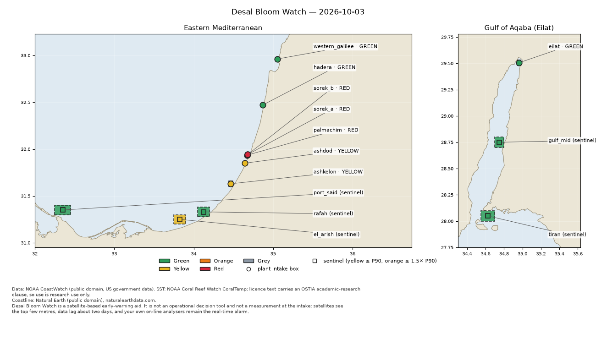

# Desal Bloom Watch

[](https://github.com/Goomal/desal-bloom-watch/actions/workflows/ci.yml)
[](LICENSE)

**A free morning report that warns when algae is building up in the sea near Israel's seawater desalination plants.**

Every day it reads NOAA satellite chlorophyll data for the water in front of each plant's intake, compares it with
what is normal for that place at that time of year, and gives each plant a colour: 🟢 green, 🟡 yellow, 🟠 orange,
🔴 red, or ⚪ grey (no usable satellite view). You get the report as a web page, a map and a short message, in
English, Hebrew or Arabic, on your own computer and, if you want, on Telegram.

**Website with a sample report:** https://goomal.github.io/desal-bloom-watch/



> **This is an early warning, not a measurement.** The satellite sees the top few metres of the sea, about 2 days
> late, in 4–9 km squares. Your plant's own analysers stay the real alarm. Personal open-source project, no warranty.

## In short

| | |
|---|---|
| **Who it is for** | Desalination plant managers, process engineers, operators, anyone watching the Israeli coast |
| **Plants** | Western Galilee, Hadera, Sorek A, Sorek B, Palmachim, Ashdod, Ashkelon (Mediterranean) and Eilat (Red Sea) |
| **What you get** | One report a day: a coloured card per plant, a map, what changed since yesterday, and the numbers behind it |
| **How it decides** | Each plant is compared with its own 6 years of history (2020–2026), never with a fixed number. Upstream points (Port Said, El-Arish, Rafah, Strait of Tiran, mid-Gulf of Aqaba) give an early hint before a bloom drifts to the plant |
| **Cost** | Free. No accounts, no API keys, no AI calls in the daily run. All data is public (NOAA) |
| **Runs on** | macOS, Linux, Windows. Python 3.11 or newer |

## Install and run it: step by step

You need about 10 minutes. Copy each command, paste it in a terminal, press Enter.

### Step 1. Install Python (once)

- **macOS / Windows:** download Python 3.11 or newer from [python.org/downloads](https://www.python.org/downloads/)
  and install it. On Windows, tick **"Add python.exe to PATH"** on the first screen.
- **Linux:** `sudo apt install python3 python3-venv` (or your distribution's equivalent).

Check: open a terminal (macOS: *Terminal*; Windows: *PowerShell*) and type `python3 --version`
(Windows: `py --version`). It should say 3.11 or higher.

### Step 2. Download Desal Bloom Watch

With git:

```bash
git clone https://github.com/Goomal/desal-bloom-watch.git
cd desal-bloom-watch
```

No git? Click the green **Code** button on this page, then **Download ZIP**, unzip it, and open a terminal in that
folder.

### Step 3. Install it

macOS / Linux:

```bash
python3 -m venv .venv
.venv/bin/pip install -e .
```

Windows (PowerShell):

```powershell
py -3 -m venv .venv
.venv\Scripts\pip install -e .
```

### Step 4. Set it up (answer a few questions)

macOS / Linux: `.venv/bin/dbw setup` &nbsp;&nbsp; Windows: `.venv\Scripts\dbw setup`

It asks you:

1. **Which plants** to watch. It shows a numbered list; type numbers or ids, e.g. `6,8` or `ashdod,eilat`.
2. **Where to save** the reports (press Enter for `./reports`).
3. **Which language**: `en`, `he` or `ar`.

Then it downloads the last 45 days of satellite data (about 2 minutes) and writes your first report. Two last
questions:

4. **Run it every day?** Say yes and it installs a daily job at 07:00 on your computer.
5. **Send it to Telegram?** Optional, see step 7.

### Step 5. Open your report

Open the `reports` folder and double-click `dbw-report-<today>.html`. The top is written for everyone; the
technical numbers are further down; the end explains every colour and term.

| Colour | Meaning |
|---|---|
| 🟢 Green | Within the normal range for this place and season |
| 🟡 Yellow | Unusually high for the season (above its usual high), or above normal and rising for 3 days |
| 🟠 Orange | Seasonal extreme, or yellow with an upstream point already high |
| 🔴 Red | Three times the seasonal median or more, or orange two days running |
| ⚪ Grey | No usable satellite view (clouds, old data). **Grey is never an all-clear** |

More: [docs/reading-the-report.md](docs/reading-the-report.md).

### Step 6. Make it run every morning

If you said yes in step 4, it is already done. Otherwise:

```bash
.venv/bin/dbw schedule install      # Windows: .venv\Scripts\dbw schedule install
.venv/bin/dbw schedule status       # shows the next run and how the last one went
```

It uses the computer's own scheduler (launchd on macOS, cron on Linux, Task Scheduler on Windows). A laptop that was
asleep at 07:00 runs it when it wakes, and the next run fills in any missed days. Details:
[docs/schedule.md](docs/schedule.md), Windows: [docs/windows.md](docs/windows.md).

### Step 7 (optional). Get it on Telegram

1. In Telegram, message **@BotFather**, send `/newbot`, follow the questions. It gives you a token.
2. Open the file `.env` in the project folder (copy `.env.example` if it is missing) and add one line:
   `DBW_TELEGRAM_TOKEN=<your token>`. Never paste the token into a chat.
3. Open your new bot in Telegram and press **Start**.
4. Run `.venv/bin/dbw telegram chat-id --write`, then `.venv/bin/dbw send-test telegram`.

From then on every daily run sends you the short message and the full report. Full guide:
[docs/telegram.md](docs/telegram.md).

### Step 8 (optional). Use it from Claude Code or Codex

```bash
.venv/bin/dbw skill install           # add --codex for Codex
```

Then type `/desal-bloom-watch` in Claude Code (`$desal-bloom-watch` in Codex). It walks you through setup with
check boxes, runs the report, and explains any level in plain words. The daily run itself never needs Claude.

## Something went wrong?

| Problem | What to do |
|---|---|
| `python3: command not found` / Python 3.9 | Install Python 3.11+ (step 1) and open a new terminal |
| No report this morning | `dbw schedule status`, then read `data/dbw-run.log` |
| "NOAA data could not be fetched today" | NOAA's server or your internet was down. The report is built from stored data and says so; the next run catches up |
| A plant is grey | Clouds or old satellite data. It is not a green |
| Telegram did not arrive | `dbw send-test telegram`; see [docs/telegram.md](docs/telegram.md) |
| Anything else | `dbw doctor` checks the setup and the data sources |

## How it works

```
NOAA satellites ──► fetch the intake boxes ──► compare with 6 years of history ──► colour per plant ──► report + map ──► folder / Telegram
 (chlorophyll, SST)    (dbw run, daily)          (seasonal percentiles)             (deterministic rules)
```

- **Data:** NOAA CoastWatch ERDDAP: VIIRS NOAA-20 chlorophyll (4 km), the gap-filled DINEOF product (9 km) and
  CoralTemp sea temperature. All public, no sign-up. Every plant location in [plants.yaml](plants.yaml) has a
  public source link. Details: [docs/sources.md](docs/sources.md).
- **Rules:** plain Python, unit-tested, no AI. Checked against the August–September 2026 Mediterranean bloom.
  Details: [docs/scoring.md](docs/scoring.md).
- **Your data stays with you:** reports, settings and the database live in the project folder. Nothing is sent
  anywhere except to the Telegram chats you choose.

## Known limits

- Satellites see the sea surface. Intakes draw from ~10–20 m, so a bloom below the surface can be missed.
- Data is about 2 days old. It is a watch, not a trip signal.
- 4 km squares near the narrow tip of the Gulf of Eilat include some coast.
- Email, Slack and webhook delivery are not built yet (Telegram and the report folder are).

## For developers

```bash
.venv/bin/pip install -e ".[dev]"
.venv/bin/python -m pytest              # offline suite; `-m live` hits the real services
```

Plan and design notes: [docs/PLAN.md](docs/PLAN.md). Translations: [docs/translations.md](docs/translations.md).
Adding a plant: [plants.yaml](plants.yaml) + `scripts/check_registry.py`; private overrides go in
`plants.local.yaml` (never committed).

---

<div dir="rtl">

## בעברית, בקצרה

**Desal Bloom Watch** הוא דוח בוקר חינמי שמתריע כשמצטברות אצות בים מול מתקני ההתפלה בישראל.
כל יום הוא קורא נתוני כלורופיל מלוויני NOAA עבור המים מול נקודת היניקה של כל מתקן, משווה אותם למה שרגיל
באותו מקום ובאותה עונה, ונותן לכל מתקן צבע: 🟢 ירוק, 🟡 צהוב, 🟠 כתום, 🔴 אדום, או ⚪ אפור (אין תצפית לוויין שמישה).

**זו התרעה מוקדמת, לא מדידה.** הלוויין רואה רק את המטרים העליונים של הים, באיחור של כיומיים. המכשור של המתקן
נשאר האזעקה האמיתית.

### התקנה בשלבים

1. **התקינו Python** בגרסה 3.11 ומעלה מ־[python.org](https://www.python.org/downloads/) (ב־Windows סמנו "Add python.exe to PATH").
2. **הורידו את הפרויקט:** כפתור **Code** הירוק ← **Download ZIP**, וחלצו. או `git clone https://github.com/Goomal/desal-bloom-watch.git`.
3. **פתחו טרמינל בתיקייה והתקינו:**
   macOS/Linux: `python3 -m venv .venv` ואז `.venv/bin/pip install -e .`
   Windows: `py -3 -m venv .venv` ואז `.venv\Scripts\pip install -e .`
4. **הגדרה:** `.venv/bin/dbw setup` (ב־Windows: `.venv\Scripts\dbw setup`). בחרו מתקנים, תיקייה, שפה `he`, והאם להריץ כל בוקר.
5. **פתחו את הדוח:** קובץ ה־HTML בתיקיית `reports`. החלק העליון כתוב לכל אחד, המספרים הטכניים למטה.
6. **אופציונלי, טלגרם:** צרו בוט אצל ‎@BotFather, שימו את הטוקן בקובץ `.env` בשורה `DBW_TELEGRAM_TOKEN=...`, לחצו Start בבוט, והריצו `dbw telegram chat-id --write`. מדריך מלא: [docs/telegram.md](docs/telegram.md).

**אפור אף פעם אינו "הכול תקין"**: הוא אומר שאין תצפית שמישה (עננים או נתונים ישנים).

</div>

## License

[MIT](LICENSE) © 2026 Shay Levite. The MIT licence covers the code. The satellite data is fetched from NOAA
CoastWatch each day and stays under each dataset's own terms (the CoralTemp sea-temperature product, for example,
carries a research-use clause); the bundled `dbw/data/percentiles.json` holds seasonal statistics derived from it.
See [docs/sources.md](docs/sources.md). Coastline: Natural Earth (public domain).
